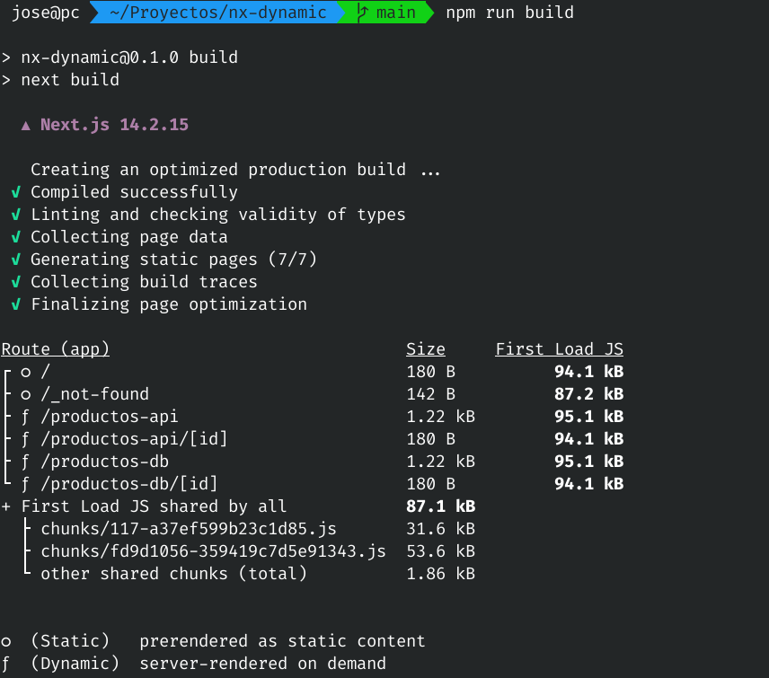

# Contenido dinámico

Este proyecto muestra como trabajar con contenido dinámico en NextJS.  
Para ello se obtienen datos de 2 fuentes distintas:

- Base de datos MySQL
- API REST 

Hay 4 páginas con contenido dinámico.

Hacen uso de **`searchParams`** para buscar en un listado de productos.
- `productos-db`
- `productos-api`

Hacen uso de **`params`** para mostrar un producto.
- `productos-db/[id]`
- `productos-api/[id]`

> **NOTA:**
>
> A partir de NextJS 15, el acceso a `params` y `searchParams` es asíncrono. A continuación se muestran ejemplos de uso:
>
> ```js
> async function Page({ params, searchParams }) {
>   const { query } = await searchParams
>   const { id } = await params
>   // ...
> }  
> 

## Construcción del proyecto

